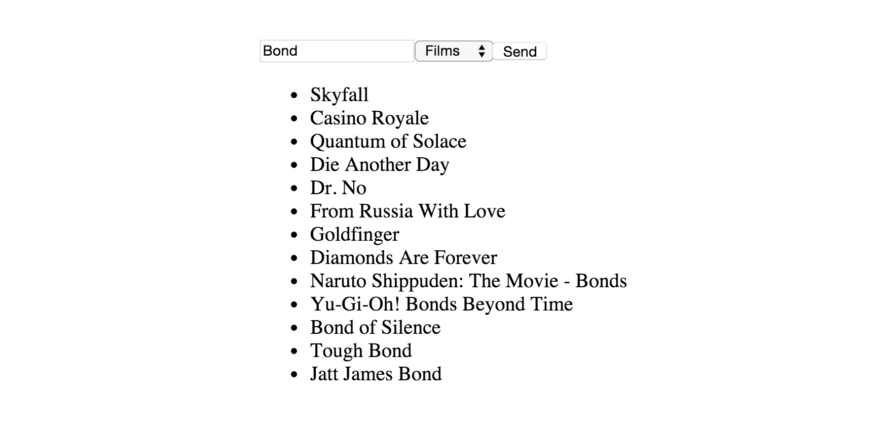

# iTunes Search App

This exercise will teach you how to use AJAX with React, so that you'll be able to send requests to API's in your React apps. You'll also be introduced to *refs*, *findDOMNode*, *getDefaultProps* and *propTypes*.

You'll be creating an app using the iTunes Search API, in which users can search for various products on iTunes.

The search area should include both an input field and a select option. The former is get the search query from the user, the latter for specifying the iTunes section (film, music, apps, podcasts etc).

Based on this, you'll show the user the most relevant products from iTunes.

To get started, clone this repo. We've linked to the jQuery CDN for you in the HTML file. Your React components ought to be added in main.js.

## Running the app

With some browsers (Safari, Firefox) you can run the app by simply dragging *index.html* into the browser. If you're using Chrome, you'll mostl likely have to start a simple server. If so, head over to the directory with your Command Line Interface and type the following:

	python -m SimpleHTTPServer

## Breaking the UI into components

Before you start coding, you'll want to break the UI into components. Check out this tutorial on how to break you UI into components.

## Fetch the users inputs

You'll need to fetch what query and category the user wants to search for. To do this, use *refs* and *findDOMNode*. Below is an example on how to you can fetch the value of an input field using this technique.

	var App = React.createClass({
		handleClick: function(){
			var query = React.findDOMNode(this.refs.query).value;
		},
		render: function(){
			return(
				

				<input 
					type="text" 
					ref="query" />
				<input 
					type"submit" 
					onClick={this.handleClick} />
			);
		},
	});

## Composing the Ajax request

In the component you'll want to send the Ajax request from, add a following method:

	sendAjax: function(query, option){
		$.ajax({
			// compose the Ajax call
		});
	}

You do not need any API key to use the iTunes Search API. Simply send your Ajax request to the following URL:

	https://itunes.apple.com/search?term=QUERY&country=us&entity=CATEGORY

Replace QUERY with the search query from the user, and CATEGORY with the correct category the user wants to search through, e.g. movie,music,film,podcast.

## Stretch goals:

If you finish up early, do the following streatch goals:

* Save feature  
The ability save items in the search results to another list.

* 